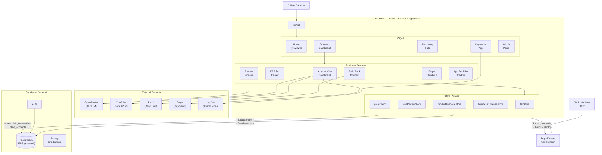
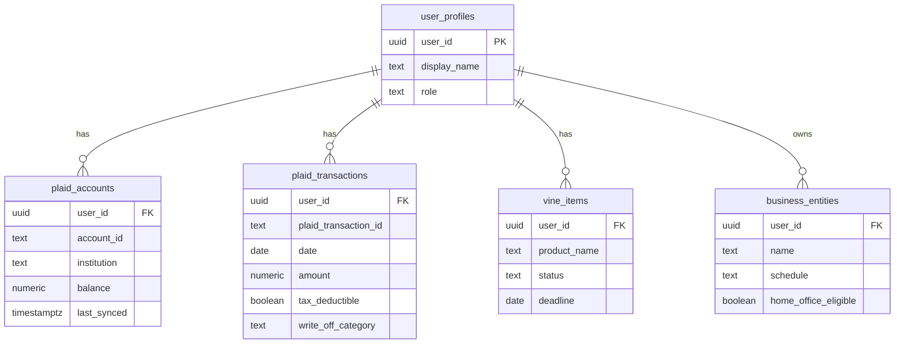

# Reese Reviews — Unified Business Dashboard

A cohesive, single-dashboard platform built for **Reese**, combining Amazon Vine tax tracking, inventory management, an AI-powered review pipeline, an ERP Tax Center, and social media content publishing.

**Live at:** [https://reesereviews.com](https://reesereviews.com)

---

## 🚀 Features

### 1. Avatar-Based Review Generation
- **Publishing Wizard:** 6-step guided process for creating review videos.
- **Stock Avatars:** Multiple personas (Professional, Casual, Unboxing) for "Caresse".
- **AI Content:** OpenRouter integration for generating scripts and metadata stripping.
- **YouTube Auto-Posting:** Direct OAuth2 integration for publishing and scheduling.

### 2. Amazon Vine & Tax Tracking
- **Native Vine Scraper:** Imports Vine orders and tracks review deadlines.
- **ETV Tracking:** IRS-compliant Estimated Tax Value tracking.
- **Tax Dashboard:** 1099-NEC reconciliation, Schedule C calculations, and multi-entity support.

### 3. Business Management
- **Multi-Entity Support:** Manage Freedom Angel Corp, Angel Reporter LLC, and other subsidiaries.
- **Inventory Management:** Track product lifecycle from "Ordered" to "Sold" or "Donated".
- **Financial Integrations:** Scaffolded support for Plaid (bank linking) and Stripe (subscriptions).

### 4. Technical Foundation
- **Architecture:** React 18, Vite, TypeScript, Tailwind CSS (Glassmorphism).
- **Data Persistence:** Supabase (PostgreSQL, Auth, Storage) with offline fallback.
- **CI/CD:** GitHub Actions (Lint, Typecheck, Test, Build, Deploy) and CodeRabbit AI PR reviews.
- **Accessibility:** WCAG 2.1 AA compliant, featuring Neurodivergent and ECO modes.

---

## 🛠️ Setup Instructions

### Prerequisites
- Node.js v22+
- Supabase Project (URL and Anon Key)
- OpenRouter API Key

### Installation
```bash
git clone https://github.com/midnghtsapphire/reese-reviews.git
cd reese-reviews
npm ci                # also installs the Husky pre-commit hook
```

### Secret Scanning (gitleaks)
A [gitleaks](https://github.com/gitleaks/gitleaks) pre-commit hook runs automatically.
Install gitleaks to enable it (optional but strongly recommended):
```bash
# macOS
brew install gitleaks
# Linux — download from https://github.com/gitleaks/gitleaks/releases
```
If gitleaks is not installed the commit still proceeds with a warning.

### Environment Variables
Copy `.env.example` to `.env` and configure your keys:
```bash
cp .env.example .env
```
*Note: Never commit `.env` to version control.*

### Run Locally
```bash
npm run dev
```

---

## 📚 Documentation

- [Changelog](CHANGELOG.md)
- [Product Backlog](docs/BACKLOG.md) — all outstanding work, prioritized for agents and humans
- [Agent Completion Guide](docs/AGENT_COMPLETION_GUIDE.md) — why agents fail to finish + playbook
- [Rollout Plan](docs/ROLLOUT_PLAN.md) — safe deployment + rollback procedures
- [Scrum & Agile Docs](docs/scrum/)
- [Branch Protection Rules](docs/BRANCH_PROTECTION.md)
- [Deployment Guide](docs/DIGITALOCEAN_DEPLOYMENT.md)
- [Security Audit](docs/SECURITY_AUDIT.md)

---

## 🏗️ Architecture

- **Frontend:** React (Vite)
- **Backend:** Supabase (Auth, Postgres, Storage)
- **Hosting:** DigitalOcean App Platform
- **CI/CD:** GitHub Actions

### Component & Data-Flow Diagram



### Data Persistence Model



---

## 📄 License
All Rights Reserved © 2026 Audrey Evans / GlowStarLabs.
This software is proprietary and confidential.
